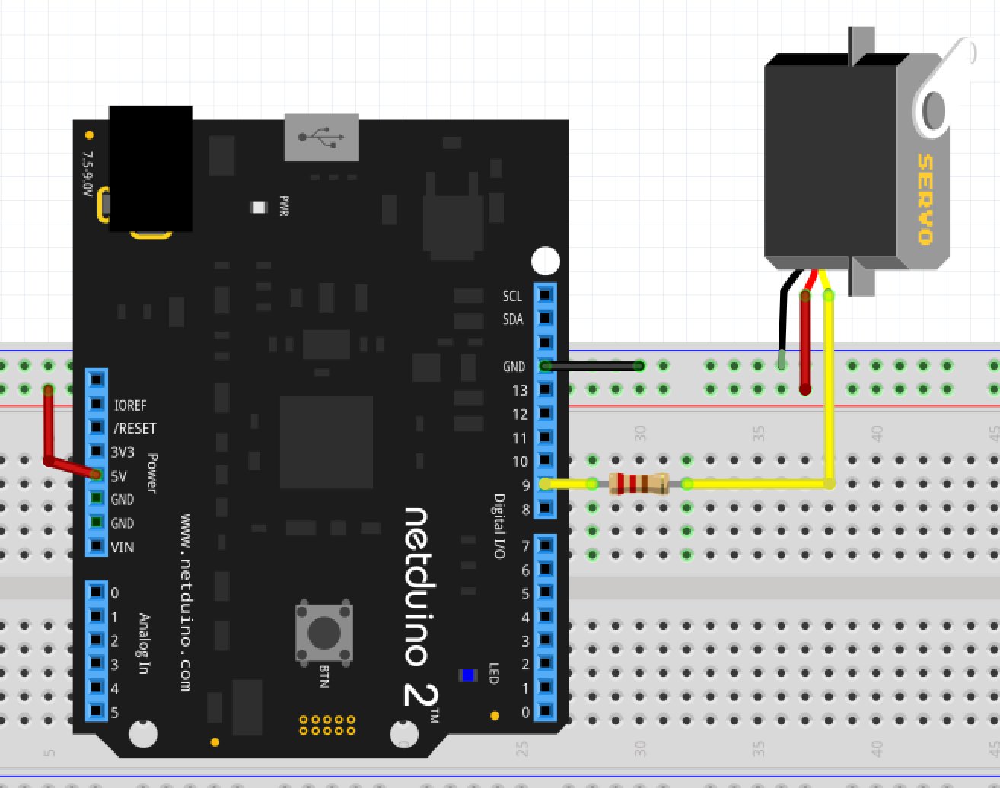

# Controlling a Servo Using PWM

This sample shows how to control a servo using a PWM signal from a Netduino.

## Discussion

A full discussion on the hardware and software can be found on the [Wilderness Labs](https://www.wildernesslabs.co/) PWM Pages:

* [Introduction to PWM](http://developer.wildernesslabs.co/Netduino/Input_Output/Digital/PWM/)
* [Controlling an Servo](http://developer.wildernesslabs.co/Netduino/Input_Output/Digital/PWM/ControllingAServo/)

## Hardware Required

* [Netduino](https://www.wildernesslabs.co/Netduino)
* [Servo Motor](https://www.sparkfun.com/categories/245)