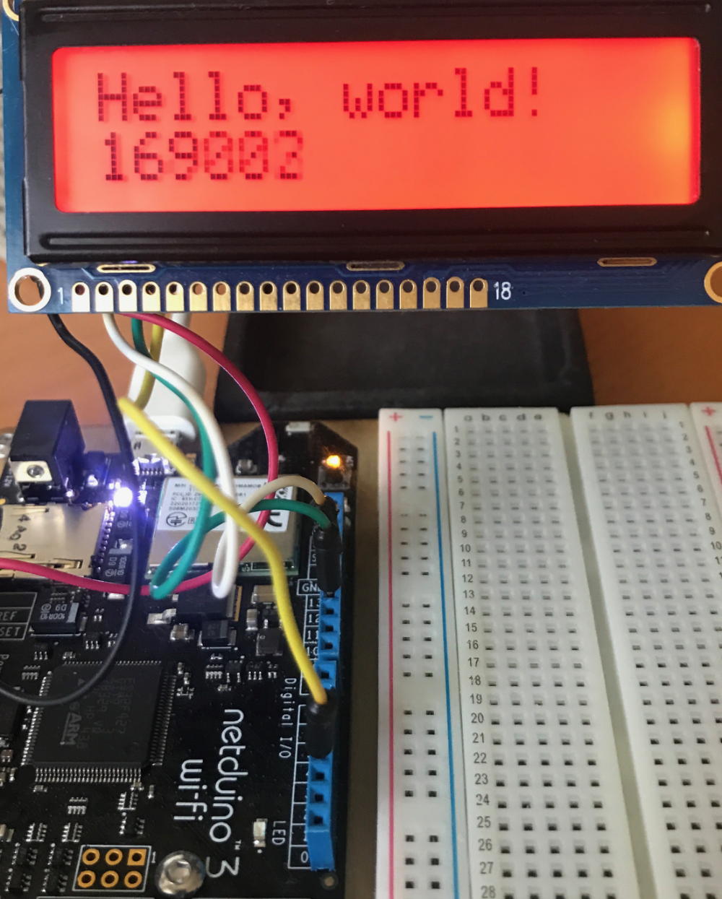

# LCD Display

This sample demonstrates how to control an LCD using the Adafruit I2C/SPI LCD backpack.

## Discussion

A full discussion on SPI and the software can be found on the [Wilderness Labs](https://www.wildernesslabs.co/) SPI Pages:

* [Introduction to SPI](http://developer.wildernesslabs.co/Netduino/Input_Output/Digital/SPI/)
* [Controlling an LCD](http://developer.wildernesslabs.co/Netduino/Input_Output/Digital/SPI/ControllingLCD/)

## Hardware Required

* [Netduino](https://www.wildernesslabs.co/Netduino)
* [Adafruit I2C / SPI LCD Backpack](https://www.adafruit.com/product/292)