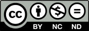

# Netduino Samples

The Netduino Samples repository contains the source code for a example projects using the Netduino family of boards.

Further information about the Netduino boards and the samples in this repository can be found in the [Wilderness Labs Developer Portal](http://developer.wildernesslabs.co/).

| Sample Name | Description |
|-------------|-------------|
| [Blinky](Blinkky/) | Quintessential Netduino `Hello, world.` application. |
| [Button with Interrupts](ButtonInterruptEvents/) | Listening to an `InterruptPort` for button press events. |
| [Controlling a Servo](ControllingAServo/) | Using PWM to control a servo. |
| [Driving an LED using PWM](DrivingLED_w_PWM/) | Driving a single LED using a PWM signal. |
| [Glitch filtering](GlitchFilter/) | Filtering circuit noise using a `Glitch Filter` in the event model. |
| [LCD Display](LCDDisplay/) | Driving a 16 x 2 LCD using the `MicroLiquidCrystal` library. | [Onboard Button and LED](OnboardButtonAndLed/) | Using the onboard button to light the onboard LED. |
| [Potentiometer and RGB LED](PotentiometerControlled_RgbLed/) | Changing the color of an RGB LED using the `AnalogPort` to read a potentiometer. |
| [RGB Blinky](RGB_Blinky/) | Simple sample driving a RGB LED. |
| [RGB LED and PWM](RgbLed/) | Driving a RGB LED using PWM. |
| [SD Cards](SDCardIO/) | Reading and writing an SD card. |
| [TMP012 - Reading temperature](TMP102BasicRead/) | Reading the temperature from a TMP102 temperature sensor. |
| [TMP102 - Writing registers](TMP102ReadWrite/) | Writing to the register on the TMP102 to reconfigure the sensor. |
| [UART](UARTTest/) | Reading a writing data to a UART. |
| [Web Request](WebRequest/) | Connecting to the internet and making a `HttpWebRequest`. |
| [Web Request (Multithreaded)](WebRequestMultithreaded/) | Making a multithreaded `httpWebRequest`. |

## [Contributing](Contributing)

Wilderness Labs welcomes and encourages constrictive contributions. We believe that documentation is best when a diverse community of folks with a variety of perspectives and experience share their wisdom and findings with others. Additionally, documentation contributions are a great way to capture learnings that you may even reference yourself.

For more information, please see the [Contributing](Contributing) page.

## License

### Documentation Prose

All the documentation prose is released under a [Creative Commons 
Attribution + Noncommercial + NoDerivatives (CC BY-NC-ND) license](Licenses/CreativecCommons_BY_NC_ND.md). Feel free to share verbatim in non-commercial usage and provide attribution. Commercial usage may be granted in certain use cases. If you need a more permissive license, please contact us at [hello@wildernesslabs.co](mailto:hello@wildernesslabs.co).

[Human Readable Version of the License](https://creativecommons.org/licenses/by-nc-nd/4.0/)

### Code Samples and Code Snippets

All code samples and code snippets, whether they be full applications, or embedded snippets within the documentation are released under the [Apache 2 license](Licenses/Apache2_License.md). Feel free to use and distribute the code as you see fit, under the very permissive terms of the license.