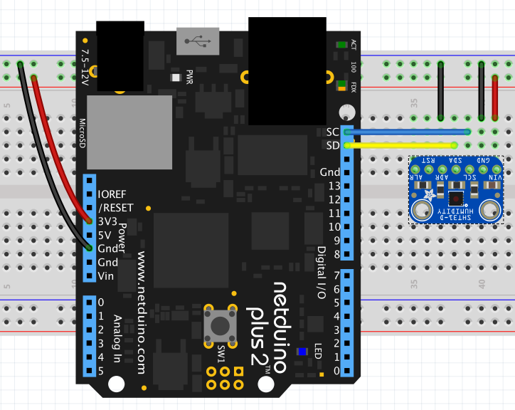

# SHT31D Temperature and Humidity Sensor

This example illustrates how to obtain temperature and humidity readings from the SHT31D temperature and humidity sensor.

# Hardware



Note that the Adafruit breakout board is supplied with pull-up resistors for the I2C lines and so these are not required for this example.

# Code

```csharp
using Microsoft.SPOT;
using Netduino.Foundation.Sensors.Barometric;
using System.Threading;

namespace SHT31DTest
{
    public class Program
    {
        public static void Main()
        {
            SHT31D sht31d = new SHT31D();

            Debug.Print("SHT31D Temperature / Humidity Test");
            while (true)
            {
                sht31d.Read();
                Debug.Print("Temperature: " + sht31d.Temperature.ToString("f2") + ", Humidity: " + sht31d.Humidity.ToString("f2"));
                Thread.Sleep(1000);
            }
        }
    }
}
```