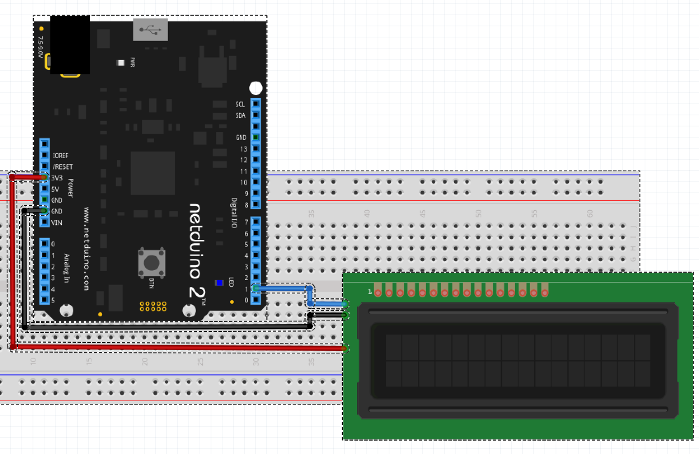

# Serial LCD

This example will demonstrate the following features of the serial LCD:

* Clearing the display
* Displaying text at a specific location on the LCD
* Scrolling the contents of the display.
* Displaying a cursor
* Moving the cursor on the display

The LCD backpack as supplied expects 5V power.  It has been demonstrated to work with 3.3V power and logic levels.  If problems are encountered then a 5V supply and logic level conversion should be used.

# Hardware

The serial LCD board requires only three connections, power, ground and the serial output from one of the Netduino serial ports:



# Code

The application below demonstrates a number of the features of the library:

```csharp
using System.Threading;
using Netduino.Foundation.Displays;

namespace SerialLCDTest
{
    public class Program
    {
        public static void Main()
        {
            var display = new SerialLCD();
            //
            //  Clear the display ready for the test.
            //
            display.Clear();
            display.SetCursorStyle(SerialLCD.CursorStyle.BlinkingBoxOff);
            display.SetCursorStyle(SerialLCD.CursorStyle.UnderlineOff);
            //
            //  Display some text on the bottom row of a 16x2 LCD.
            //
            display.SetCursorPosition(2, 1);
            display.DisplayText("Hello, world");
            Thread.Sleep(1000);
            //
            //  Now scroll the text off of the display to the left.
            //
            for (int index = 0; index < 16; index++)
            {
                display.ScrollDisplay(SerialLCD.Direction.Left);
                Thread.Sleep(500);
            }
            //
            //  Put some text on the top line of the display (note that the
            //  text is still off to the left of the display).
            //
            display.SetCursorPosition(0, 0);
            display.DisplayText("Scrolling Right");
            Thread.Sleep(500);
            //
            //  Now scroll the text back on to the display from the left to
            //  the right of the display.
            //
            for (int index = 0; index < 16; index++)
            {
                display.ScrollDisplay(SerialLCD.Direction.Right);
                Thread.Sleep(500);
            }
            //
            //  Now put a cursor on the display and move it around.
            //
            display.SetCursorStyle(SerialLCD.CursorStyle.BlinkingBoxOn);
            for (int index = 0; index < 10; index++)
            {
                display.MoveCursor(SerialLCD.Direction.Left);
                Thread.Sleep(200);
            }
            Thread.Sleep(1000);
            display.SetCursorStyle(SerialLCD.CursorStyle.BlinkingBoxOff);
            //
            //  Done.
            //
            Thread.Sleep(Timeout.Infinite);
        }
    }
}

```