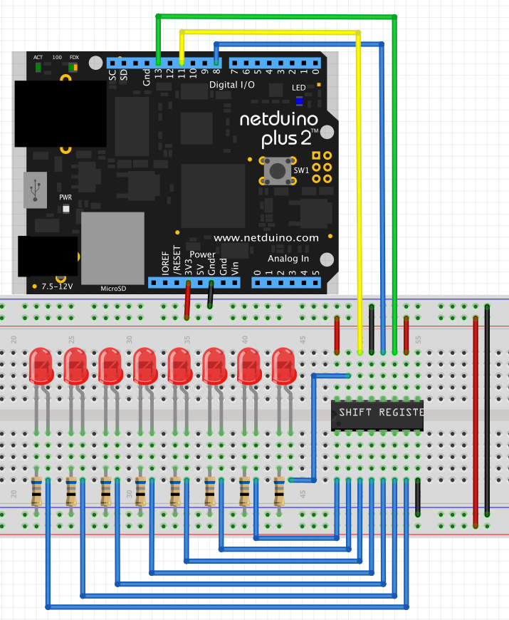

# Shift Register (74HCT595)

This example will demonstrate how to use the 74HCT595 as an output expander for the Netduino.  The sample application will light a series of 8 LEDs in a continuous loop.

# Hardware

The following hardware is required for this example:

* 8 x LEDs
* 8 x current limiting resistors (`68 Ohm` in this case)
* 1 x 74HCT595

The hardware should be assembled as follows:



# Code

```csharp
using Netduino.Foundation.IC;
using SecretLabs.NETMF.Hardware.NetduinoPlus;
using System.Threading;

namespace ShiftRegisterTest
{
    public class Program
    {
        public static void Main()
        {
            ShiftRegister74595 shiftRegister = new ShiftRegister74595(8, Pins.GPIO_PIN_D8);
            while (true)
            {
                for (byte index = 0; index <= 7; index++)
                {
                    shiftRegister[index] = true;
                    shiftRegister.LatchData();
                    Thread.Sleep(500);
                    shiftRegister[index] = false;
                }
            }
        }
    }
}
```