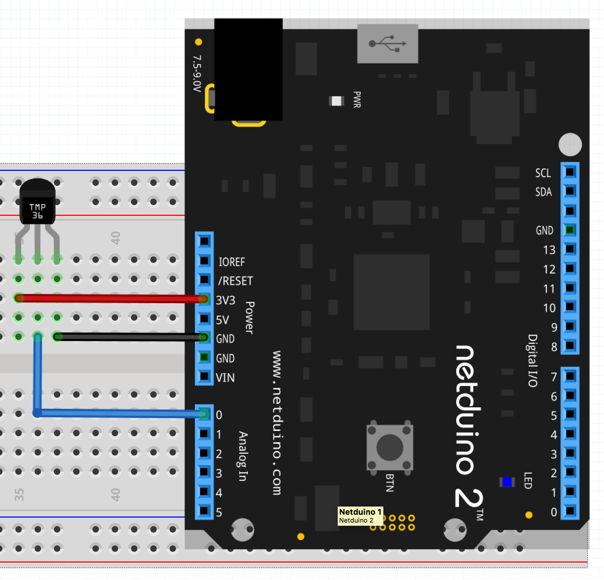

# Read Temperature Using TMP36 Temperature Sensor

The code below reads the current temperature using the TMP36 temperature sensor.  These are available from [Adafruit](https://www.adafruit.com/product/165) and [Sparkfun](https://www.sparkfun.com/products/10988).

The TMP36 application uses the analog temperature sensor driver in the [Netduino.Foundation library](https://github.com/WildernessLabs/Netduino.Foundation).

# Hardware

The TMP36 requires only three connection, power, ground anf the sensor analog output:



Care should be taken when wiring up the TMP36 as reversing the ground and power connections will burn out the component.

# Code
```csharp
using System.Threading;
using Microsoft.SPOT;
using SecretLabs.NETMF.Hardware.NetduinoPlus;
using Netduino.Foundation.Sensors.Temperature.Analog;

namespace NFAnalogTemperatureSensorTest
{
    public class Program
    {
        public static void Main()
        {
            Debug.Print("** Read TMP36 **");
            var tmp36 = new AnalogTemperatureSensor(AnalogChannels.ANALOG_PIN_A0, AnalogTemperatureSensor.SensorType.TMP36);
            while (true)
            {
                Debug.Print("Reading: " + tmp36.Temperature.ToString("f2"));
                Thread.Sleep(5000);
            }
        }
    }
}
```